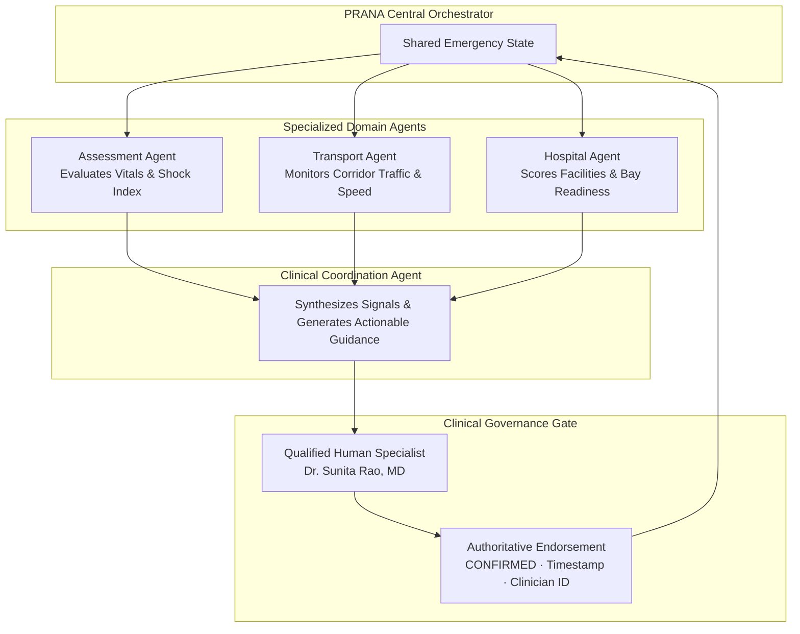

# PRANA — Full-Stack Technical Architecture & Engine Specification
## Prehospital Emergency Coordination & Intelligence Platform

> **Document Type**: System Architecture Specification  
> **Document Type**: System Architecture Specification  
> **Status**: Phase 18 Auditability, Prehospital Handover Package & Structured Export Complete  
> **Evolutionary Scope**:  
> - **PHASE 14 COMPLETED**: React 19 + Frontend API Adapter (`src/services/api/`) + FastAPI + SQLite (`prana.db`) + Persistent EmergencyCase + Append-Only Event Store (`timeline_events`)  
> - **PHASE 15 COMPLETED**: Case-Scoped WebSockets + Event Versioning Catch-up + Multi-Role Browser Synchronization  
> - **PHASE 16 COMPLETED**: JWT Authentication + Argon2id Hashing + Role-Based Access Control (RBAC) + Case-Level Access Authorization  
> - **PHASE 18 COMPLETED**: Prehospital Handover Package (`HandoverPackageModel`), RFC 8785 Canonical JSON Serialization, Cryptographic SHA-256 Content Digest Verification, Multi-Format Export (Standard JSON & HL7 FHIR R4 Bundle Prototype), Hospital Handshake (`status="ACKNOWLEDGED"`), and A4 Print Layout  
> - **PHASE 19 COMPLETED**: Agentic Clinical Coordination Engine (`AgentOrchestrator`, `ReadOnlyToolRegistry`, Multi-Turn Bounded Loop, Missing Data Detection, Safety Gate, Care Rail Overhaul, Clinician `AgentActivityPanel`)  
> - **PHASE 20 COMPLETED**: Real Local Open Model Activation (`LocalOpenModelProvider`, Ollama / vLLM, `Qwen/Qwen2.5-3B-Instruct`), 22-Case Synthetic Benchmark Gate (100% Tool/Safety/Review Compliance), Runtime Health Probing (`GET /api/v1/ai/provider-status`), and Resilient Deterministic Fallback Continuity  
> - **OFFLINE/DEMO FALLBACK**: Graceful fallback to deterministic local simulation engine when FastAPI or AI is unreachable  
> - **FUTURE PRODUCTION REQUIREMENTS**: Multi-Tenant Micro-Coordination, Production EHR Interoperability (SMART on FHIR), Hardware Telemetry Gateway  


---

## 1. Architectural Evolution Matrix

| Dimension | Tier 1: Legacy Prototype (Phase 1–13) | Tier 2: Phase 14–17 Full Stack + Safe AI (Implemented) | Tier 3: Future Production Requirements |
| :--- | :--- | :--- | :--- |
| **Frontend Core** | React 19, TypeScript strict, Vite 8, Tailwind CSS v4, Context API | React 19, Clean Client API Layer, Realtime WS Subscription, Clinical Spatialism | Progressive Web App (PWA) with ServiceWorker offline cache |
| **State Management** | Central `EmergencyContext` in-memory state | Dual-Mode `EmergencyContext`: Persistent Backend Sync + Realtime WS + Local Engine | Distributed event-sourced state with CRDTs for multi-device sync |
| **Persistence** | In-memory deterministic scenario seeds (`allScenarios`) | Local SQLite database (`prana.db`) via SQLAlchemy + Pydantic v2 schemas | Encrypted PostgreSQL with automated time-series partitioning |
| **Event Store** | In-memory `activeCase.timeline` array | **Append-Only Event Store** (`timeline_events` table) with immutable payloads | Multi-channel Pub/Sub (Redis / NATS) across regional EMS corridors |
| **Realtime Sync** | Simulated in-memory React state | Case-scoped WebSocket hub (`/api/v1/ws/cases/{id}`) with monotonic catchup | Geodistributed WebSocket cluster / gRPC bi-directional streaming |
| **Security & RBAC** | Cosmetic frontend role toggling | JWT (HS256) + Argon2id + Backend Role Guards + Case Participant Authorization | Multi-factor WebAuthn/FIDO2, OAuth2/OIDC, SAML, ABAC policies |
| **Decision Support / AI** | Hardcoded simulation rules in client | **Provider-Neutral AI Abstraction** (`AIProvider`) + `DemoDecisionSupportProvider` + `ClinicalSafetyValidator` + Persisted `AI_SIGNAL_GENERATED` events | Fine-tuned clinical foundation models with real-world clinical validation & ML governance |
| **Network & Offline** | 100% offline in-browser self-contained execution | **Dual-Mode**: Persistent DB & AI when online, seamless `OFFLINE_FALLBACK` when offline | Zero-trust bi-directional mesh networking for low-connectivity zones |
| **Hospital Integration** | Algorithmic scoring formula (40% Fit + 30% Avail + 30% ETA) | Bidirectional bay reservation, pre-alert REST, and WS status synchronization | Direct EHR interoperability via HL7 FHIR v4 `Encounter` / `Observation` |


---

## 2. Full-Stack Data & Event Flow Architecture (Phase 14)

```
┌──────────────────────────────────────────────────────────────────────────┐
│                               REACT 19 FRONTEND                          │
│     (Ambulance Field Command · Clinician Console · Hospital Command)     │
└────────────────────────────────────┬─────────────────────────────────────┘
                                     │
                     ┌───────────────┴───────────────┐
                     ▼                               ▼
        ┌─────────────────────────┐     ┌─────────────────────────┐
        │  Client API Adapter     │     │  Local Fallback Engine  │
        │  (src/services/api/)    │     │  (emergencyEngine.ts)   │
        └────────────┬────────────┘     └─────────────────────────┘
                     │ (HTTP / JSON)
                     ▼
        ┌─────────────────────────┐
        │     FASTAPI BACKEND     │
        │  (/api/v1/cases, etc.)  │
        └────────────┬────────────┘
                     │
         ┌───────────┴───────────┐
         ▼                       ▼
┌─────────────────┐     ┌──────────────────────────────────┐
│ SQLite Database │     │   APPEND-ONLY EVENT STORE        │
│ (prana.db)      │     │   (timeline_events table)        │
│ Canonical Case  │     │   - Immutable Chronological Log  │
│ Snapshot        │     │   - Powers Care Rail Across Roles│
└─────────────────┘     └──────────────────────────────────┘
```
                                     │
                 ┌───────────────────┴───────────────────┐
                 ▼                                       ▼
    ┌─────────────────────────┐             ┌─────────────────────────┐
    │    EmergencyContext     │◄────────────┤   emergencyEngine.ts    │
    │  (Single State Store)   │             │ (Pure State Transition) │
    └────────────┬────────────┘             └─────────────────────────┘
                 │
  ┌──────────────┼──────────────┬──────────────┬──────────────┐
  ▼              ▼              ▼              ▼              ▼
PORTAL      FIELD_MEDIC     CLINICIAN       HOSPITAL      READINESS
Mission     Ambulance       Decision        Command &     Equipment
Director    Workspace       Support         Bay Ready     Inventory
```

### 2.2 Unidirectional State Flow & Auto-Propagation Principle
In PRANA, data flows strictly unidirectionally from domain events into pure state mutators:
1. Paramedic registers an observation, logs an intervention, or live telemetry drifts.
2. The state engine applies pure transition functions:
   - `registerPatientState(prevCase, patient)`
   - `triggerVitalDeteriorationState(prevCase, newVitals)`
   - `confirmClinicianProtocolState(prevCase, docId, docName, action, notes)`
   - `recalculateFacilityMatchState(prevCase, override)`
   - `confirmHospitalBayReadyState(prevCase, bay, confirmedBy)`
3. **Automated CDS Propagation**: When patient or vital changes occur, `EmergencyCase.aiDecisionSupport` and `EmergencyCase.cdsDataPackage` update synchronously without requiring manual paramedic "send" button clicks.
4. **Subscribed Consoles Refresh**: Clinician Workspace and Hospital Command automatically receive the updated context via the shared `EmergencyContext`.

---

## 3. The Core Data Model (`EmergencyCase`)

The central domain model represents an unbroken prehospital corridor:

```typescript
export interface EmergencyCase {
  id: string; // e.g. "PR-8492" (Trauma), "PR-7104" (Snakebite), "PR-9521" (Poisoning)
  domain: 'TRAUMA' | 'SNAKEBITE' | 'POISONING';
  status: 'REPORTED' | 'DISPATCHED' | 'ONBOARD' | 'IN_TRANSIT' | 'ARRIVED' | 'HANDED_OVER';
  scenarioTitle: string;
  
  // Patient Context
  patient: PatientProfile; // id, name, age, sex, chiefComplaint, consciousState, gcsScore, reportedBloodLoss
  
  // Mobile Transport Asset
  ambulance: AmbulanceUnit; // callSign, crewLead, currentSpeedKmH, baseEtaMinutes, trafficDelayMinutes, isTrafficDelayed, effectiveEtaMinutes
  
  // High-Density Physiological Stream
  currentVitals: VitalSnapshot; // timestamp, heartRate, spo2, systolicBp, diastolicBp, respiratoryRate, temperatureC, isAbnormal
  vitalsHistory: VitalSnapshot[]; // 10-point rolling history for sparkline trend analysis
  
  // Chronological Mission Log
  timeline: TimelineEvent[]; // id, timestamp, category, title, detail, actor, status
  
  // Spatial Journey Step
  conduitStep: number; // 0: Incident, 1: Assessed, 2: Ambulance, 3: Clinician, 4: Facility, 5: Hospital Ready, 6: Arrival
  
  // Clinical Decision Support
  aiDecisionSupport?: AiDecisionSupport; // riskLevel, riskScore, detectedSignals[], clinicalSignificance, nextStepRecommendation
  
  // Clinician Supervision Handshake
  clinicianAlertReceived?: boolean;
  clinicianEndorsement?: ClinicianEndorsement; // status, clinicianName, clinicianId, timestamp, notes, authorizedProtocol
  
  // Hospital Allocation & Bay Handshake
  hospitalReadiness?: HospitalReadiness; // status, assignedBay, confirmedBy, timestamp, resourcesReady[]
  facilityMatching?: {
    recommendedHospitalId: string;
    algorithmRationale: string;
    candidates: HospitalCandidate[]; // name, traumaLevel, matchScore, clinicalFitScore, availabilityScore, etaScore, rationale
  };
  
  // Automated Package Telemetry
  cdsDataStatus?: 'NOT_SENT' | 'SENT' | 'RECEIVED';
  cdsDataPackage?: CdsDataPackage;
  cdsDataSentAt?: string;
}
```

---

## 4. The Domain Event Model

PRANA is architected around an explicit, append-only event stream. Every major operational occurrence produces a typed domain event recorded into `activeCase.timeline`:

```
Domain Event Stream
├── CASE_CREATED                  (Emergency registered in dispatch corridor)
├── PATIENT_ASSESSED              (Demographics, conscious state, GCS, blood loss)
├── VITAL_RECORDED                (Serial physiological snapshot logged)
├── OBSERVATION_ADDED             (Clinical sign noted: e.g., SLUDGE toxindrome, ascending edema)
├── INTERVENTION_RECORDED         (Paramedic intervention logged: IV access, splint, suction)
├── CLINICAL_SIGNAL_CREATED       (Simulation engine identifies observable risk pattern)
├── CDS_CONTEXT_UPDATED           (Automated clinical package synchronized to clinician console)
├── CLINICIAN_REVIEW_REQUESTED    (Specialist paged for critical deterioration)
├── CLINICIAN_REVIEWED            (Physician executes CONFIRM, ESCALATE, or REQUEST DATA)
├── FACILITY_RECOMMENDED          (40/30/30 matching engine ranks receiving centers)
├── FACILITY_CONFIRMED            (Primary receiving ED designated)
├── HOSPITAL_PREALERT_SENT        (Inbound clinical package dispatched to receiving facility)
├── HOSPITAL_ACKNOWLEDGED         (ED charge nurse acknowledges pre-alert)
├── HOSPITAL_BAY_READY            (Sterile resuscitation bay confirmed and staffed)
├── TRAFFIC_UPDATED               (Transit delay incurred: +8 mins single ETA drift)
├── CARE_CONTINUES                (Uninterrupted clinical stabilization documented during delay)
├── PATIENT_ARRIVED               (Ambulance wheels stop at emergency bay)
└── HANDOVER_COMPLETED            (Formal clinical handover signed off at bedside)
```

**Care Rail Direct Binding**: The `CareRail` component binds directly to `activeCase.timeline` without any secondary state bookkeeping.

---

## 5. Agent Orchestration Architecture

Rather than building disconnected "chatbots," PRANA utilizes a **multi-agent supervisory coordinator** operating over the single shared `EmergencyCase`:



### Agent Responsibilities:
1. **Assessment Agent**: Evaluates physiological trends, shock indices, hypoxia drifts, and toxicology patterns. Emits `CLINICAL_SIGNAL_CREATED`.
2. **Transport Agent**: Tracks ambulance coordinates, arterial congestion, and computes `derivedEta = baseEtaMinutes + trafficDelayMinutes`. Emits `TRAFFIC_UPDATED`.
3. **Hospital Agent**: Computes the 40/30/30 facility match formula based on clinical specialty fit, live bed availability, and transit ETA. Emits `FACILITY_RECOMMENDED`.
4. **Clinical Coordination Agent**: Aggregates inputs into an explainable summary for the tele-specialist.
5. **Qualified Human Specialist (The Gate)**: The AI proposal remains unexecuted until confirmed by an authorized human clinician.

---

## 6. AI Provider Abstraction Layer

To ensure PRANA is never locked into a single commercial AI vendor, all language model interactions are isolated behind a clean provider interface:

```typescript
export interface AiSummaryRequest {
  caseId: string;
  domain: string;
  patient: PatientProfile;
  vitals: VitalSnapshot;
  timelineEvents: TimelineEvent[];
  interventions: string[];
}

export interface AiSummaryResponse {
  executiveSummary: string;
  identifiedRiskFactors: string[];
  recommendedClinicianReviewPoints: string[];
  latencyMs: number;
  provider: string;
}

export interface IAiProvider {
  name: string;
  summarizeCase(request: AiSummaryRequest): Promise<AiSummaryResponse>;
  structureFieldNotes(rawText: string): Promise<{ observations: string[]; interventions: string[] }>;
  explainFacilityChoice(facility: HospitalCandidate): Promise<string>;
}
```

### Supported Provider Implementations:
1. **`LocalDeterministicEngine` (Current Baseline)**: Pure TypeScript in-memory rule engine. Zero network latency, 100% offline reliability.
2. **`FreeOpenAiAdapter` (Target Phase)**: Fast, free-tier API adapter (e.g., Groq free tier with Llama-3.3-70B or Ollama local inference).
3. **`EnterpriseClinicalAdapter` (Future)**: Dedicated private deployment on HIPAA-eligible infrastructure.

---

## 7. Target Backend Architecture (FastAPI Modular Monolith)

For productization beyond the client-side prototype, the backend will evolve as a clean, modular monolith:

```
backend/
├── app/
│   ├── main.py                     # FastAPI application entry & middleware
│   ├── api/
│   │   ├── v1/
│   │   │   ├── cases.py            # Case lifecycle endpoints
│   │   │   ├── vitals.py           # Vitals ingestion & time-series streaming
│   │   │   ├── endorsements.py     # Clinician protocol endorsement gate
│   │   │   ├── facilities.py       # Transparent hospital matching & pre-alerts
│   │   │   └── ws.py               # WebSocket telemetry hub
│   ├── core/
│   │   ├── config.py               # Environment & CORS configuration
│   │   ├── security.py             # JWT authentication & clinician RBAC
│   │   └── events.py               # Internal domain event dispatcher
│   ├── domain/
│   │   ├── models/                 # SQLAlchemy DB models (Case, Vital, Event)
│   │   └── schemas/                # Pydantic v2 validation models
│   ├── engine/
│   │   ├── facility_matcher.py     # 40/30/30 transparent scoring algorithm
│   │   └── simulation_engine.py    # Deterministic physiological rules
│   └── services/
│       ├── ai_service.py           # Provider adapter manager
│       └── notification_service.py # Pre-alert & hospital dispatchers
```

---

## 8. Data Ownership, Security & Audit Boundaries

1. **Patient Data Ownership**: In-transit telemetry belongs strictly to the patient encounter record. Upon physical hospital handover, custody of the telemetry stream transfers to the receiving hospital EHR.
2. **Clinician Authorization Ledger**: Every protocol endorsement (`CONFIRMED`, `DATA_REQUESTED`, `ESCALATED`) records:
   - Clinician Unique ID (`clinicianId`, e.g. `DOC-482`)
   - Clinician Full Name & Credential (`clinicianName`, e.g. `Dr. Sunita Rao, MD`)
   - Exact timestamp (`timestamp`, ISO 8601)
   - Protocol Designation (`authorizedProtocol`)
3. **Encryption Standard**:
   - In-Transit: TLS 1.3 with 256-bit AES encryption.
   - At-Rest: SQLite/PostgreSQL volume encryption with SQLCipher / LUKS.
4. **Audit Immutability**: Timeline events cannot be modified or deleted. Any corrections require an offsetting clinical note event.

---

## 9. Phase 15 Real-Time Synchronization Architecture

Phase 15 connects PRANA's multi-role operational workspaces (Ambulance, Clinician, Hospital Command) into a live, shared emergency coordination fabric:

```
                            EMERGENCY CASE
                                  │
                          SQLite Database
                    (cases, timeline_events)
                                  │
                        Event Dispatcher
                     (dispatch_event_nowait)
                                  │
                        WebSocket Gateway
                  (/api/v1/ws/cases/{case_id})
           ┌──────────────────────┼──────────────────────┐
           ▼                      ▼                      ▼
    AMBULANCE TAB          CLINICIAN TAB           HOSPITAL TAB
  (Field Telemetry)     (Protocol Endorse)       (Bay Readiness)
           ▲                      ▲                      ▲
           └──────────────────────┴──────────────────────┘
                          LIVE SHARED STATE
```

### 9.1 Core Architectural Principles
1. **Persist-Then-Broadcast**:
   - Every domain mutation (vitals, interventions, clinician actions, traffic delays, bay readiness) executes inside an ACID database transaction.
   - If persistence succeeds, the transaction commits, increments the case version, and schedules the broadcast.
   - If persistence fails or aborts, **no real-time event is broadcast**, preventing phantom state propagation.
2. **Case-Scoped Channel Isolation**:
   - Clients subscribe to a single emergency channel: `WS /api/v1/ws/cases/{case_id}?client_id={id}&role={role}`.
   - Events occurring in Trauma (`PR-8492`) never leak to Snakebite (`PR-7104`) or Poisoning (`PR-9521`).
3. **Monotonic Versioning**:
   - Each emergency case maintains a strictly increasing version counter (`current_version`).
   - Every persisted timeline event receives `version = case.current_version`.
   - Clients track the highest version seen to detect out-of-order or stale events.
4. **Standard Event Envelope**:
   ```json
   {
     "eventId": "evt-1790341884435-PR-8492",
     "caseId": "PR-8492",
     "eventType": "VITAL_RECORDED",
     "version": 18,
     "timestamp": "10:45:00",
     "actor": {
       "type": "FIELD MEDIC",
       "id": "MEDIC-102"
     },
     "payload": {
       "currentVitals": { ... },
       "aiDecisionSupport": { ... }
     }
   }
   ```
5. **Reconnection & Catch-Up Reconciliation**:
   - The client WebSocket implements exponential backoff reconnection (`1s, 2s, 4s, 8s, 15s`).
   - Upon reconnecting, the client calls `GET /api/v1/cases/{case_id}/events?after_version={lastSeenVersion}` to seamlessly recover any events missed during disconnection.
6. **Duplicate & Stale Event Protection**:
   - Clients maintain an LRU cache of recently processed `eventId`s (up to 300).
   - Any incoming event with an already-seen `eventId` or `version <= lastKnownVersion` is safely discarded.
7. **Offline & REST Fallback**:
   - If WebSocket transport fails, PRANA continues operating via REST persistence.
   - If the backend is offline, PRANA falls back to local deterministic in-memory execution with an amber `OFFLINE FALLBACK` status badge.

---

## 10. Phase 16 Authentication, RBAC & Case Authorization

### 10.1 Role Authority Matrix
- `FIELD_MEDIC`: Can record vitals, interventions, and transit delays. Cannot confirm clinician review plans or mark hospital bays ready.
- `REMOTE_CLINICIAN`: Can view ambulance telemetry and recorded interventions as read-only. Authoritative for `CONFIRM`, `REQUEST DATA`, `ESCALATE`, and `ACKNOWLEDGE`. Cannot mutate ambulance records or mark hospital bays ready.
- `HOSPITAL_COMMAND`: Can view arrival window, transport ETA, and patient triage summary. Authoritative for `BAY_READY` confirmation and resource allocation. Cannot modify clinical records or endorse specialist protocols.
- `READINESS`: Can update facility inventory and resource operational readiness. Cannot edit patient records.
- `PORTAL_ADMIN`: Universal oversight and scenario reset authority. Admin authority does not implicitly confer clinical treatment authority.

### 10.2 Demo Persona Switching vs Production Identity
- **DEMO ONLY**: Persona switching exists strictly for demonstration walkthrough convenience.
- **FUTURE PRODUCTION**: Production identity is tied to verified enterprise credentials (OAuth2 / OIDC / WebAuthn). Cross-role visibility is strictly read-only and never grants mutation authority.

---

## 11. Phase 17 AI Provider Abstraction & Safe Decision Support

```
   Emergency Case Event (e.g. VITAL_RECORDED)
                     │
         Least-Privilege Context Builder
           (build_ai_case_context)
                     │
           AI Provider Abstraction
                 (AIProvider)
          ┌──────────┴──────────┐
          ▼                     ▼
DemoDecisionSupportProvider   Future Local / Cloud LLM
          └──────────┬──────────┘
                     │
       Clinical Safety Validator
        (ClinicalSafetyValidator)
  - Rejects Autonomous Prescriptions
  - Rejects Autonomous Diagnoses
  - Enforces SIMULATED DECISION SUPPORT label
  - Enforces requiresClinicianReview = True
                     │
       Persist-Then-Broadcast Pipeline
  - Persist DecisionSupportSignalModel
  - Append AI_SIGNAL_GENERATED to Timeline
  - Broadcast via WebSocket (/ws/cases/{id})
                     │
          Clinician Workspace
  - Spacious 6-Step Editorial Hierarchy
  - Observable Telemetry Findings + Provenance
  - Authoritative Specialist Action Protocol
```

### 11.1 Non-Negotiable Clinical Safety Boundaries
1. **AI Never Prescribes or Administers**:
   - AI outputs are classified strictly as *Simulated Decision Support / Observable Signals*.
   - Prohibited verbs ("administer", "prescribe", "give antidote", "start medication", "titrate") are blocked at the validator layer.
2. **AI Never Autonomously Diagnoses**:
   - Diagnostic assertions ("patient has hemorrhagic shock", "confirmed diagnosis of") are rejected.
3. **Continuous Fallback & Resilience**:
   - AI failures, timeouts, or parse exceptions never interrupt vital recording or primary care coordination (`AI_FAIL_OPEN=true`).
4. **No Chatbot Slop**:
   - PRANA rejects generic chatbot prompt interfaces in favor of spatial clinical decision support integrated into the care pathway.

---

## 12. Phase 18 Prehospital Handover Package, Auditability & Interoperability Architecture

```
                               CANONICAL EMERGENCY CASE + EVENT STORE
                           (cases table + timeline_events append-only)
                                              │
                                              ▼
                             HANDOVER PACKAGE SYNTHESIS PIPELINE
                                (app.services.handover_service)
                                              │
     ┌────────────────────────────────────────┼────────────────────────────────────────┐
     ▼                                        ▼                                        ▼
Clinical Telemetry & Vitals             Interventions & Meds                    Observable Signals
(source_event_id provenance)            (clinician / medic ID)              (safety label disclaimer)
     └────────────────────────────────────────┬────────────────────────────────────────┘
                                              │
                                              ▼
                                 CANONICAL SERIALIZATION & HASHING
                            (json.dumps with sort_keys=True, compact separators)
                                              │
                                              ▼
                                 SHA-256 INTEGRITY DIGEST
                         (integrity_hash: 64-character hex string)
                                              │
                     ┌────────────────────────┴────────────────────────┐
                     ▼                                                 ▼
             PERSISTENCE & EVENTS                              REALTIME BROADCAST
     - HandoverPackageModel (prana.db)                   - dispatch_event_nowait(HANDOVER_GENERATED)
     - timeline_events (HANDOVER_GENERATED)              - WebSocket: /ws/cases/{case_id}
                     │                                                 │
                     ▼                                                 ▼
        RECEIVING ED HANDSHAKE                            SPATIAL VISUALIZATION
     - POST /handover/{id}/acknowledge                   - PrehospitalHandoverPanel modal
     - HOSPITAL_COMMAND role only (RBAC)                 - Care Rail SHA-256 digest drawer
     - timeline_events (HANDOVER_ACKNOWLEDGED)           - A4 Print Layout (@media print)
                     │
                     ▼
         STRUCTURED EXPORT LAYER
     - format=json: Canonical JSON with provenance
     - format=fhir: HL7 FHIR R4 Bundle (Composition, Patient, Encounter, Observation, Procedure)
```

### 12.1 Handover Lifecycle & Invariants
1. **Derived Snapshot Invariant**: The handover package is a derived projection of the prehospital transit record at a specific point in time. Generating a package does not rewrite or reset historical records.
2. **Deterministic Canonicalization**:
   - `build_handover_dictionary` assembles a dictionary conforming to `PrehospitalHandoverPackageSchema`.
   - The JSON serialization for hashing explicitly excludes volatile verification metadata and uses deterministic key ordering (`sort_keys=True`, separators `(',', ':')`).
   - The resulting digest matches byte-for-byte across repeated calls with identical data.
3. **Audit Trail & Event Provenance**:
   - Every vital record and procedure carries its `source_event_id` originating from the immutable `timeline_events` table.
   - Any external auditor or receiving physician can trace any physiological data point directly back to its exact timeline event.
4. **HL7 FHIR R4 Prototype Interoperability Mapping**:
   - `Composition`: Prehospital Emergency Summary document header (`LOINC 67796-3`).
   - `Patient`: Demographics, emergency ID.
   - `Encounter`: Emergency transit encounter (`class=EMER`).
   - `Observation`: Vital signs (`LOINC 8867-4` Heart Rate, `59408-5` SpO2, `85354-9` Blood Pressure, `9279-1` Respiratory Rate) with FHIR extension `http://prana.health/fhir/StructureDefinition/source-event-id` mapping back to timeline events.
   - `Procedure`: Prehospital stabilization measures with SNOMED-CT codes.

---

## 13. Production Gaps & Future Agentic Orchestration Roadmap

### 13.1 Real-World Production Gaps
1. **Clinical Validation**: Algorithmic rules, risk thresholds, and demo signals are demonstration logic, not validated clinical decision rules.
2. **Regulatory Assessment**: Requires formal FDA / CE Software as a Medical Device (SaMD) evaluation.
3. **EHR / EMS Interoperability**: Requires full SMART-on-FHIR authorization, complete US Core / NEMSIS v3 data profiles, and enterprise EHR bidirectional syncing (Epic / Cerner).
4. **Enterprise Identity & Zero Trust**: Production requires hardware-backed FIDO2 / WebAuthn, mutual TLS for ambulance gateways, and hospital federated SSO (SAML / OIDC).
5. **Production Data Infrastructure**: Migration from local SQLite to time-series optimized, HIPAA-compliant PostgreSQL cluster with encrypted-at-rest volumes.
6. **Legally Binding Digital Signatures**: Production handoffs require digital signatures complying with PKI / eIDAS / 21 CFR Part 11 standards rather than demonstration content hashes.

### 13.2 Future Agentic AI Coordination (Conceptual Roadmap)
In future phases, PRANA may introduce specialized autonomous support agents (e.g. Traffic Corridor Re-routing Agent, Antivenom Cold-Chain Supply Agent, Bay Readiness Dispatch Agent) structured strictly under human-in-the-loop clinical supervision. Autonomous agents will propose operational recommendations while qualified clinicians and hospital command retain sole execution authority.


