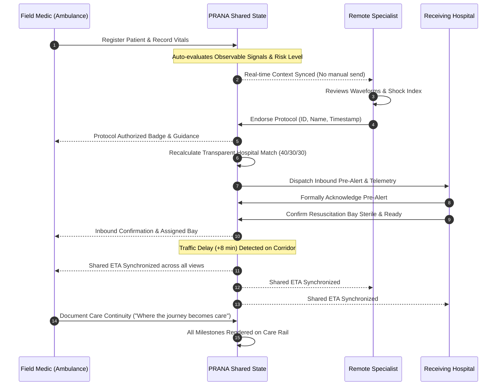

# PRANA — Product Requirements Document (PRD)
## "Where the Journey Becomes Care"

> **Document Type**: Core Product Requirements Document  
> **Status**: Approved Foundation Specification (Post-Competition Productization)  
> **Classification**: Clinician-Supervised Emergency-Care Coordination Platform  
> **Last Updated**: March 2026  

---

## 1. Executive Summary & Product Vision

### 1.1 Product Vision
**PRANA** is an unbroken prehospital emergency coordination and tele-specialist intelligence platform. Its foundational mandate is captured in a single operational thesis:
> *"If the ambulance cannot beat the traffic, the treatment should not have to wait for it."*

In modern prehospital emergency care, transit time in heavy urban traffic is typically treated as dead time—unmonitored transit where patient clinical deterioration goes unmanaged, tele-specialists remain disconnected, and receiving emergency departments (EDs) are caught unprepared upon ambulance arrival.

PRANA transforms this journey into an active, continuous clinical stabilization corridor by uniting:
1. Continuous bi-directional sensor streaming from the field ambulance.
2. Explainable, real-time simulated decision support highlighting observable physiological patterns.
3. Synchronized tele-specialist clinical oversight and protocol endorsement.
4. Receiving hospital resuscitation bay readiness handshakes before arrival.

### 1.2 Core Platform Definition & Technical Foundation (Phase 16)
**PRANA is explicitly a clinician-supervised emergency-care coordination platform.**
- It is **NOT** an autonomous diagnostic engine, an unsupervised AI doctor, or a replacement for certified physicians.
- All clinical protocol endorsements, medication authorizations, and triage determinations remain strictly under human clinician authority.
- **Phase 16 Authentication, RBAC & Case Authorization**:
  * **Cryptographic Identity**: Argon2id password hashing + JWT minimal-claims bearer token authentication.
  * **Role-Based Access Control (RBAC)**: Server-side permission gating ensuring only qualified roles perform specific actions (e.g., only `REMOTE_CLINICIAN` can endorse review plans; only `HOSPITAL_COMMAND` can confirm bay readiness).
  * **Case-Level Access Boundaries**: `CaseParticipantModel` relationships isolate cases; users can only view or subscribe to emergencies they are actively assigned to.
  * **Authoritative Event Attribution**: Domain event actor identity is derived authoritatively from the verified JWT principal—never trusted from client payloads.
  * **Real-Time WebSocket Security**: WebSockets mandate authentication before subscription, validating case assignment and rejecting unauthorized connections cleanly (4401/4403).
  * **Persistent Emergency Cases**: SQLite-backed case aggregate root (`cases` table) managing synchronized patient, ambulance, vitals, signals, and facility readiness.
  * **Append-Only Event Store**: Immutable mission ledger (`timeline_events` table) with monotonic versioning recording every vital, intervention, clinician action, and bay status change.
- *Notice*: PRANA is a research and development prototype with persistent state and real-time synchronization capabilities; it does not claim certified clinical deployment, prospective clinical trial validation, or regulatory approval.

---

## 2. Core Problem Statement

### 2.1 The Prehospital Emergency Gap
1. **Transit Dead Time**: Patients in acute distress (polytrauma hemorrhage, hemotoxic viperid envenomation, organophosphate cholinergic crisis) deteriorate during transit while paramedics are constrained by localized protocols.
2. **Specialist Isolation**: On-call emergency physicians, trauma surgeons, and toxicologists have zero real-time visibility into the patient until physical arrival at the emergency bay.
3. **Fragmented Communication**: Paramedics rely on unstandardized phone or radio calls to alert hospitals, resulting in incomplete handovers, lost physiological trend context, and unprepared resuscitation suites.
4. **Sub-optimal Receiving Hospital Matching**: Patients are often routed to the nearest hospital rather than the facility with optimal verified capabilities (e.g., active angio-embolization suite, dedicated antivenom cold chain stocks, or available ICU ventilator bays).
5. **Traffic Volatility**: Urban traffic delays unpredictably inflate transit times without updating hospital readiness timelines or extending prehospital care protocols.

---

## 3. Primary Users & User Roles

PRANA serves five primary operational roles working across a single synchronized emergency state:

| Role Identifier | Role Name | Primary User Persona | Primary Surface & Core Objective |
| :--- | :--- | :--- | :--- |
| `FIELD_MEDIC` | Field Paramedic / EMT Lead | Advanced Life Support (ALS) Paramedic in ambulance | **Ambulance Workspace**: Patient intake, serial vital sign observation, prehospital intervention logging, and continuous telemetry transmission. |
| `REMOTE_CLINICIAN` | Remote Tele-Specialist | On-call Trauma Physician, Toxicologist, or ED Consultant | **Clinician Workspace**: Real-time review of streaming vitals, observable pattern signals, and authoritative protocol endorsement (`CONFIRM`, `REQUEST DATA`, `ESCALATE`, `ACKNOWLEDGE`). |
| `HOSPITAL_COMMAND` | Receiving ED Charge Team | ED Nurse Coordinator, Trauma Team Lead, Bay Manager | **Hospital Command**: Inbound corridor arrival countdown, bay readiness handshake (`BAY READY`), and capability verification. |
| `READINESS` | Medical Readiness Officer | EMS Logistics & Equipment Coordinator | **Medical Readiness View**: Verification of prehospital kit readiness, oxygen reserves, antivenom cold chain stocks, and resuscitation packs. |
| `PORTAL` | Mission Portal / Director | EMS Dispatch Controller / System Supervisor | **Mission Portal**: Multi-scenario launcher, regional fleet overview, and rapid simulation reset. |

---

## 4. Main Workflows & Information Propagation

### 4.1 Automatic Information Propagation (No Manual "Send" Bottlenecks)
In previous prototypes, paramedics had to manually click "Send to Clinician" after recording data. **In PRANA Product Foundation, this pattern is retired.**

**The PRANA Propagation Principle:**
```
PARAMEDIC ENTERS DATA / SENSORS STREAM
             │
             ▼
PRANA SHARED EMERGENCY STATE UPDATES AUTOMATICALLY
             │
             ▼
RELEVANT CLINICAL SIGNALS IMMEDIATELY BECOME VISIBLE TO SPECIALIST
             │
             ▼
CLINICIAN CONSOLE NOTIFIED (Visual Priority Badge + Live Stream Context)
             │
             ▼
EXPLICIT HUMAN ACTION OCCURS ONLY WHERE CLINICAL AUTHORITY MATTERS
(e.g., Clinician Protocol Endorsement, Hospital Bay Readiness Confirmation)
```

1. **Continuous Telemetry Drift**: Every 3.5s (or upon real sensor heartbeat), physiological updates (HR, SpO2, BP, RR) flow into `activeCase.currentVitals` and `activeCase.vitalsHistory`.
2. **Automated Clinical Signal Synthesis**: The simulation decision engine continuously evaluates observable patterns (e.g., Shock Index > 0.9, narrowed pulse pressure, hypoxic drift) without requiring a human button click.
3. **Passive Clinician Context Refresh**: The remote specialist console renders updated vitals, calculated indices, and trend sparklines synchronously with zero manual polling.
4. **Targeted Human Authorization**: The clinician retains sole authority to execute high-stakes protocol actions (`CONFIRM`, `ESCALATE`, `REQUEST DATA`).

### 4.2 End-to-End Emergency Corridor Lifecycle


---

## 5. Current Capabilities (Baseline Assets)

PRANA is built on a verified, resilient foundation:
1. **Single Source of Truth Emergency Engine**: Centralized in `src/context/EmergencyContext.tsx` and `src/context/emergencyEngine.ts`.
2. **Strict ETA Single Source of Truth**: Centralized formula `derivedEta = baseEtaMinutes + trafficDelayMinutes` consumed identically across Ambulance, Clinician, Hospital Command, and Global Shell.
3. **Deterministic 3-Scenario Matrix**:
   - **`PR-8492` Trauma**: Rahul Verma, 34M — High-velocity MVC, pelvic fracture, retroperitoneal hemorrhage risk, tachycardia (HR 112+ bpm), Shock Index > 1.14, Manipal Hospital Level-1 Trauma Suite.
   - **`PR-7104` Snakebite**: Sunita Gowda, 28F — Russell's viper envenomation, progressive local edema (>10 cm margin), 20WBCT whole blood clotting failure watch, Victoria Hospital Toxicology & Antivenom Center.
   - **`PR-9521` Poisoning**: Manoj Kumar, 45M — Agricultural organophosphate inhalation, SLUDGE cholinergic crisis, severe bradycardia (HR 42-54 bpm), SpO2 90% → 84%, copious bronchorrhea, MS Ramaiah Medical Center Toxicology ICU.
4. **45-Assertion State Machine Acceptance Gate**: Automated test suite (`npm test` / `tsx scripts/audit-state-machine.ts`) passing 45/45 assertions across all scenarios and verify deterministic reset.
5. **Care Conduit Centerpiece**: Domain-adapted spatial centerpiece (`journey`, `clinical`, `readiness`).
6. **Chronological Care Rail**: Single-array timeline event tracker (`activeCase.timeline`) with audit ledger table toggle.
7. **100% Offline Demonstration Capability**: Runs completely self-contained in-browser with zero external network dependencies required during offline demonstrations.

---

## 6. Planned Capabilities & Productization Roadmap

### Phase 1: Serious UI Redesign & Automatic Propagation (Immediate)
- Modernize visual design to feel like a high-confidence clinical operating layer (deep navy structural accents, electric blue interactions, cyan telemetry, emerald ready states, warm off-white canvas).
- Redesign Care Conduit into an unbroken, continuous care route with integrated state nodes and corridor telemetry.
- Eliminate manual "send to clinician" steps; implement auto-propagation with clinical review badges.
- Expand data visualization for multi-stream vital trends without SVG clipping.

### Phase 2: AI Provider Abstraction & Smart Assistance
- Establish clean provider adapter interface (`IAiProvider`).
- Implement free/open local and API inference options (Groq / Ollama / open-weight models) behind strict clinical safety guards.
- Deploy assistive AI tasks: free-text ambulance note structuring, clinical case summarization, facility match rationale generation.

### Phase 3: Modular Backend & Event Persistence
- FastAPI modular monolith service with Pydantic validation schemas.
- SQLite local database for zero-config persistence, migrating seamlessly to PostgreSQL.
- WebSocket / Server-Sent Events (SSE) server for true multi-device ambulance-to-hospital streaming.

### Phase 4: Clinical Standards & Interoperability
- Export case packages as standard HL7 FHIR `Encounter` and `Observation` bundles.
- Integration endpoints for regional EMS CAD (Computer-Aided Dispatch) systems and 108/911 networks.

---

## 7. Product Boundaries & Non-Goals

### What PRANA IS:
- A real-time prehospital coordination layer.
- An explainable decision-support surface for qualified medical personnel.
- A bi-directional bridge between moving ambulances and receiving hospitals.
- A shared clinical context engine.

### What PRANA IS NOT (Non-Goals):
1. **NOT an Autonomous Prescribing Agent**: PRANA will never calculate doses and instruct automated infusion pumps without human physician confirmation.
2. **NOT a Diagnostic AI Classifier**: PRANA outputs observable physiological patterns (e.g., "Compensated shock pattern: persistent tachycardia and narrow pulse pressure"), not definitive diagnostic declarations.
3. **NOT a Full Hospital EHR / Billing System**: PRANA focuses strictly on prehospital transit and arrival handover.
4. **NOT a Generic Chatbot**: PRANA does not present an open-ended chatbot persona; all interaction is structured, clinical, and actionable.

---

## 8. Clinical Safety & Regulatory Governance

1. **Human-in-the-Loop Governance**: Every intervention, medication order, or protocol escalation requires a recorded `clinicianId`, `clinicianName`, and ISO `timestamp`.
2. **Demonstration Logic Disclosure**:
   > *All clinical thresholds (shock index, hypoxia cutoffs, toxindrome patterns) in the competition build are demonstration logic, not validated clinical decision rules.*
3. **Deterministic Safety Fallbacks**: In the event of network disruption, sensor packet loss, or AI adapter downtime, the platform gracefully degrades to deterministic offline mode without blocking vital sign display or prehospital logging.
4. **Audit Trail Immutability**: All timeline events recorded in the `activeCase.timeline` array are append-only and stamped with actor attribution (`FIELD MEDIC`, `SYSTEM`, `AI SUPPORT`, `CLINICIAN`, `RECEIVING ED`).

---

## 9. Success Criteria & Quality Gates

| Metric | Target Standard | Verification Method |
| :--- | :--- | :--- |
| **State Machine Integration** | 100% (45/45 assertions pass) | `npm test` (`scripts/audit-state-machine.ts`) |
| **State Synchronization** | Zero ETA or vitals divergence across roles | Automated unit and integration assertions |
| **Reset Fidelity** | Clean reset across scenarios with zero state leakage | Multi-scenario transition audit test |
| **Performance (Lighthouse)** | ≥ 90 Performance, ≥ 90 Accessibility | Lighthouse CI runner |
| **Visual Quality Bar** | High-density clinical spatialism, zero emoji-as-icons, tabular numbers | Design system & browser audit |
| **Backend Test Coverage** | ≥ 80% measured statement coverage (pytest-cov) | `pytest --cov=app tests/` |
| **AI Safety Policy** | 100% rejection of unauthorized prescription/diagnosis directives | `pytest tests/test_ai.py` |

---

## 10. Phase 17 AI Provider Abstraction & Role Authority Specification

### 10.1 AI Output Contract: Simulated Decision Support
AI produces strictly typed `DecisionSupportSignal` objects:
- `signalId`, `caseId`, `generatedAt`, `provider`, `providerVersion`, `signalType`
- `title`: Short clinical descriptor (e.g., "Hemodynamic Change Signal")
- `observedData`: Specific sensor deltas and trends triggering the signal
- `explanation`: Context-grounded physiological rationale labeled as demonstration logic
- `relevantTimelineEventIds`: Explicit provenance referencing contributing vital/observation events
- `requiresClinicianReview`: Always `true`
- `status`: `NEW` | `ACKNOWLEDGED` | `SUPERSEDED`
- `safetyLabel`: Mandated string `SIMULATED DECISION SUPPORT — NOT A DIAGNOSIS`

### 10.2 Role Authority & Data Boundary Invariant
1. **Cross-Role Data Visibility is Read-Only**:
   - A logged-in `REMOTE_CLINICIAN` sees ambulance vitals, patient observations, and field interventions. This view is strictly **read-only**; the clinician cannot edit ambulance telemetry or record field procedures.
   - An authenticated `FIELD_MEDIC` records patient vitals and procedures, but cannot endorse tele-specialist review plans.
   - `HOSPITAL_COMMAND` receives incoming patient summary and arrival countdown, but cannot alter patient vitals or approve clinician protocols.
2. **Demo Persona Switcher vs Production Identity**:
   - Persona switching is preserved strictly for hackathon walkthrough convenience.
   - In production, user authority is immutably bound to authenticated organization credentials.
3. **Event-Driven Automatic Evaluation**:
   - Telemetry recording automatically triggers decision-support evaluation on the backend. No manual "Send to AI" gate is permitted.
4. **Fail-Open Resilience**:
   - AI provider downtime, latency spikes, or validator rejections never disrupt vital recording or emergency coordination.

---

## 11. Phase 18 Auditability, Handover Package & Structured Export Specification

### 11.1 The Prehospital Handover Package Architecture
The Prehospital Handover Package (`PrehospitalHandoverPackage`) converts the entire prehospital transit corridor into a consolidated, immutable digital handoff summary upon ambulance arrival at the receiving emergency department.
- **Derived Point-in-Time Snapshot**: Synthesized from the active case aggregate and append-only `timeline_events`. Historical events and case states remain completely untouched.
- **Canonical Structure**:
  1. **Patient Identity & Chief Complaint**: Core demographics, acuity status, incident mechanism.
  2. **Transport & Corridor Telemetry**: Responding unit, origin, target facility, transit duration, distance.
  3. **Vitals & Hemodynamic Progression**: Chronological series of all recorded vitals with explicit `source_event_id` tracking.
  4. **Interventions & Procedures**: Complete log of medications, procedures, and stabilization measures with actor IDs.
  5. **Simulated Decision Support**: Objective observable signals, telemetry deltas, and the mandatory safety disclaimer (`SIMULATED DECISION SUPPORT — NOT A DIAGNOSIS`).
  6. **Specialist Review & Endorsements**: Clinician authorization records with clinician ID, timestamp, and protocol status.
  7. **Receiving Facility Readiness**: Destination hospital, target bay, facility capabilities, and pre-arrival readiness confirmation.
  8. **Provenance & Auditability**: Event count, generation timestamp, generator user ID, and SHA-256 cryptographic digest.
  9. **Completeness & Quality Metrics**: Evaluates clinical documentation completeness (vitals logged, interventions documented, clinician review conducted, destination ready) without blocking handoff.

### 11.2 Cryptographic Content Integrity (SHA-256 Digest)
- Every generated package is normalized into canonical JSON (RFC 8785 sorting) and hashed using SHA-256.
- The resulting 64-character hexadecimal digest (`integrityHash`) is stored alongside the package.
- Receivers can verify integrity via `GET /cases/{case_id}/handover/{package_id}/verify` or client-side recalculation, guaranteeing that the prehospital record has not been altered post-generation.

### 11.3 Multi-Format Structured Export Layer
- **Native JSON Export**: Complete machine-readable payload with full clinical and provenance attributes.
- **HL7 FHIR R4 Bundle Prototype**: Converts the prehospital record into a standard FHIR Document Bundle:
  * `Composition`: Prehospital Emergency Summary document header.
  * `Patient`: Subject of care with emergency identifiers.
  * `Encounter`: Emergency prehospital transit encounter with participating actors.
  * `Observation`: Serial vital signs (LOINC coded) with extension-based provenance tracing back to `source_event_id`.
  * `Procedure`: Prehospital interventions (SNOMED-CT coded).

### 11.4 Receiving Facility Reception & Handshake
- Receiving ED teams (`HOSPITAL_COMMAND`) formally acknowledge custody and clinical handoff via `POST /cases/{case_id}/handover/{package_id}/acknowledge`.
- Unauthorized roles (e.g. `FIELD_MEDIC`) are denied (HTTP 403 Forbidden).
- Acknowledgement transitions the package to `ACKNOWLEDGED`, appends `HANDOVER_ACKNOWLEDGED` to the immutable Care Rail, and broadcasts in real time via WebSocket.

### 11.5 Print-Optimized Emergency Department Handoff Sheet
- Clean CSS `@media print` rules format the handover package into a professional, monochrome, multi-section A4 physical printout (`window.print()`).
- Hides all navigation, interactive buttons, modal overlays, and persona selectors while preserving high-contrast clinical tables, vital progression graphs, and the SHA-256 verification hash box.

### 11.6 Research Prototype & Regulatory Notice
- *Notice*: PRANA's Prehospital Handover Package, cryptographic content hash, and FHIR export are developed as an advanced demonstration of prehospital coordination. They are not certified under Meaningful Use / ONC Health IT, FDA SaMD, or legally binding digital signature frameworks.


